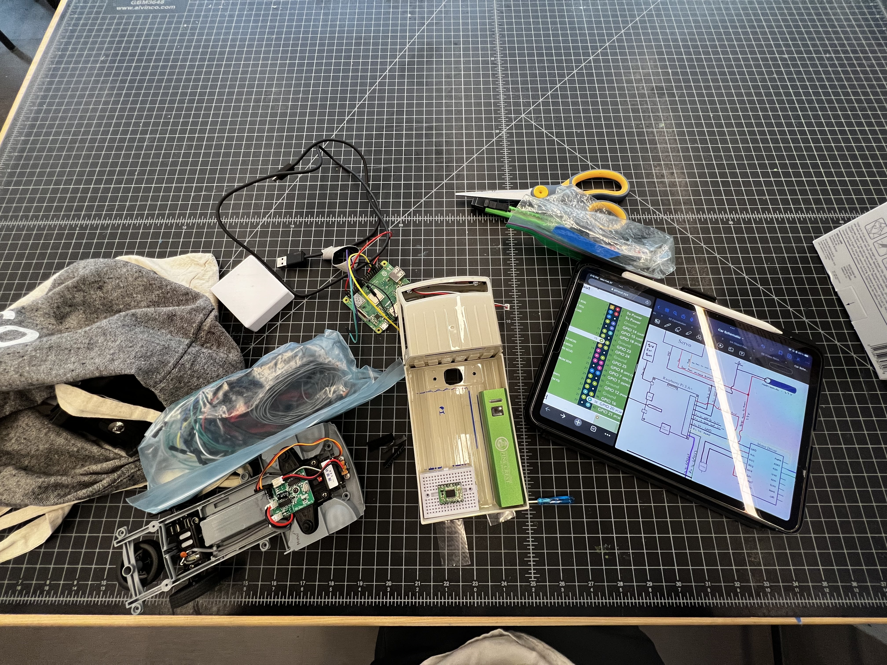
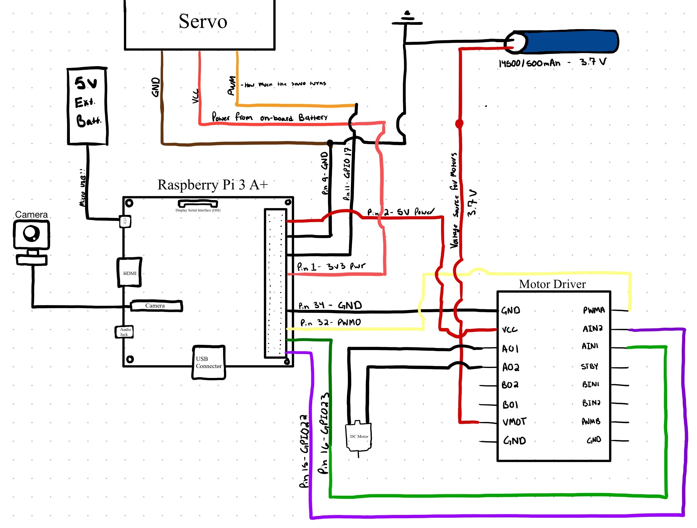
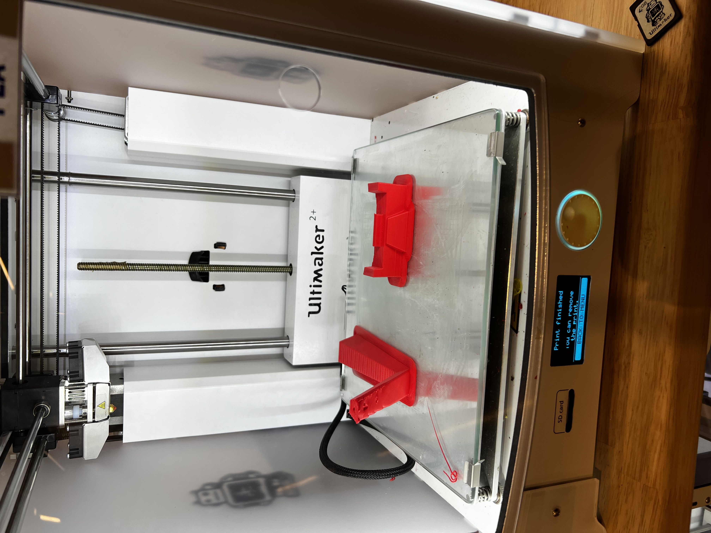

**Where am I now?**
After completing research about Computer Vision models to be used on the car, and research on hardware specs for the car itself, I gathered all the parts necessary to construct the car. My final list of hardware is:

1. 1/16 Scale RC Car Truck (Base)
2. Raspberry Pi 3 Model A+ (On-board computer)
3. Pololu TB6612FNG Dual Motor Driver Carrier (Takes signals from the Pi and moves the motor wheels and servo)
4. Portable Battery
5. Camera

Since I am introducing new elements to the circuitry, I had to create schematic diagrams connecting the Raspberry Pi, Motor driver, Servo, and on-board battery. Here is the most up to date schematic:

I started by Mapping out where to place each piece on the bed of the truck, then decided it would be best to 3D print a case for the Pi as well as a block for it to stand on. After printnig each of those I began the electrical connections. 

At this point, the car has been 90% constructed with the absence of a camera holder, which has been 3D printed along with a railing that will go over the truck bed. ThThese are the completed pieces:

**WHat's next?**
I need to mount the camera and protect the bed of the car with the main circuitry, and load all of the models from the open-source donkey car library onto the raspberry pi, which is when we'll see if the car is wired correctly. Hopefully I didn't break anything!

