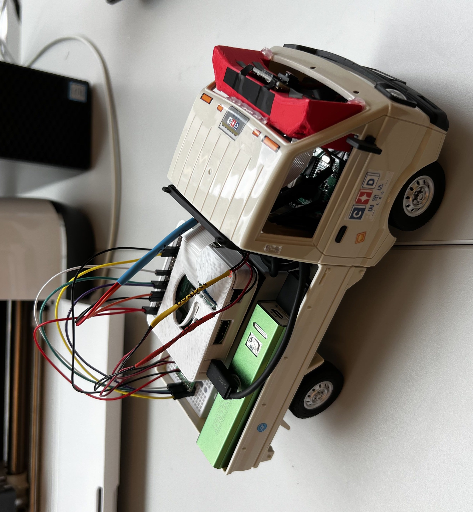
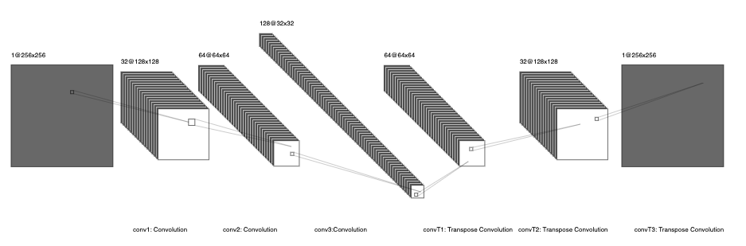

**Where am I now?**
Since my last update, the hardware of Ironhide is completely finished. I initially encountered problems with the DC actuator not working or being connected, but I was able to troubleshoot and find out that my problem was the lack of a connection between the Raspberry Pi and the standby port of the Pololu Motor Driver. Once I added the connection, I found that power had to be supplied to the standby connection, as well as the PWM module must be activated in order to have the motor working correctly. A full picture of Ironhide can be seen below.

Test files for each component of the car were created and have been uploaded to the [Ironhide GitHub repository](https://github.com/kofimeighan/ironhide). 

Now that the hardware components have been squared away, I put my focus on the network architecture for stop sign detection. The neural network architecture I chose is comprised of 3 Convolutional layers, 3 Convolutional Transpose layers, dropout, maxpooling, and Rectified Linear Units for a baseline activation function. The input to the network is a 256x256 RGB image taken from the on-board camera, and passed through the network, with about 500k trainable parameters. A visualization of the network is shown here.

The lack of accurate training data for my model was the largest roadblock I faced on the software side. Early on in hardware construction I cut the connection between the remote control transmitter and the DC actuators and servo motor. My most recent update is that I was able to implement a keyboard controller that can control Ironhide through SSH. 

I also will be utilizing a Proportion-Integral-Derivative controller to keep the car on the constructed track. The PID controller will provide streering and throttle values to Ironhide to prevent it from going off course

**What's Next?**
I'm loading data with the correct format into my model is where I am currently stuck. My next step will be collecting training data using the keyboard controller I implemented. After training and testing, I want to implement more object detection for chair legs and walls, then a full running loop that integrates the CNN and PID controller to let the car drive itself through the loop.

More importantly, I want to document my entire process from start until now into a single guide called the Ironhide Guide. The purpose of this guide will be as a low-stress, low-cost, introduction for students that want a beginning understanding of robotics to hopefully act as a gateway to a deeper love for robotics engineering.

